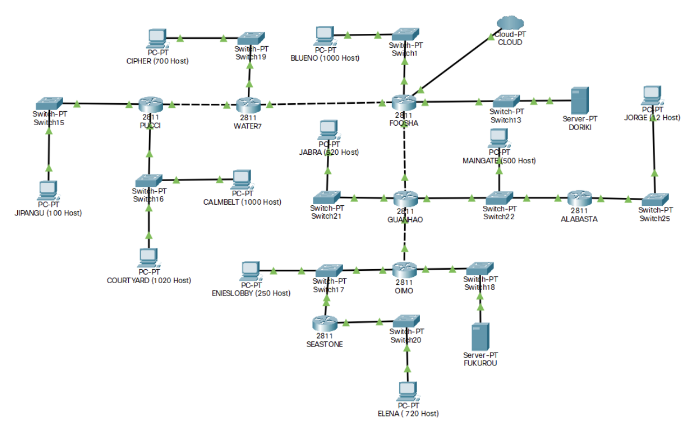

# Jarkom-Modul-4-C08-2021

Berikut adalah laporan resmi Praktikum Jaringan Komputer Modul 4 tahun 2021

Anggota Kelompok C08 :

- 05111940000100 - Muhammad Raihan
- 05111940000208 - Inez Yulia Amanda
- 05111940000209 - Refaldyka Galuh Pratama



## Carrier Packet Transport (CPT) - CIDR
### Menghitung NID
Hal pertama yang dilakukan untuk menghitung NID adalah menentukan subnet - subnet yang ada pada topologi. Terbentuklah 15 buah subnet seperti gambar berikut :


Dalam CIDR tahap selanjutnya adalah menggabungkan tiap - tiap subnet mulai dari yang paling jauh dari router utama (foosha). Lalu hasil penggabungan tersebut dibuat sebuah Pohon. Untuk tampilan pohonnya dapat dilihat [disini](https://miro.com/app/board/o9J_lhIFaO4=/).
Dalam pohon tersebut, dihitunglah pembagian IP dimulai dari root pohon. Tiap node pada pohon pasti memiliki panjang subnet yang berbeda - beda. Pada tiap node bagi 2 jumlah IP yg tersedia. Letakkan NID masing - masing pada child node. hingga didapat NID masing - masing subnet. Pindahkan kedalam tabel agar mudah dilihat.


### Memasukkan IP pada masing - masing Node dalam Topologi
Sebagai contoh, berikut cara mengkonfigurasi IP pada node Foosha untuk subnet A6 pada gambar sebelumnya. Gunakan IP yang tersedia pada subnet A6 yaitu mulai dari 10.18.192.0. Jangan lupa masukkan juga netmask-nya.


Lalu konfigurasikan host di subnet A6, yaitu BLUENO. Masukkan gateway sesuai alamat IP Foosha pada subnet A6. Gunakan IP yg tersedia pada subnet A6 yaitu mulai dari 10.18.192.0 selain yang sudah digunakan untuk gateway menuju foosha. Jangan lupa masukkan juga netmask-nya.


Lakukan kedua hal tersebut pada seluruh Node dan Subnet dalam topologi yang telah dibuat.

### Routing
Untuk menghubungkan 2 buah node yang tidak berada dalam 1 subnet, diperlukan routing. Routing akan mengarahkan paket yang dikirim dari suatu node menuju ke suatu subnet. Ambil contoh untuk menghubungkan router utama Foosha menuju Subnet A4. Untuk menghubungkan kedua hal tersebut diperlukan routing yang mengarah ke router pada subnet A4. Hal pertama yang dilakukan adalah membuat daftar routing pada konfigurasi node Foosha. Isikan Alamat dan Netmask Cipher serta NextHop (Gateway menuju Subnet A4, alias Water7).


Lalu konfigurasikan default routing pada Water7.


Lakukan kedua hal tersebut hingga terhubung antara Foosha dengan subnet yang ada pada topologi

### Testing
Untuk mengecek apakah dua buah node sudah dapat saling mengirim paket, gunakan Simple PDU.


Lalu, klik saja 2 buah node yang akan dilakukan pengecekan (Source dan Destination).


Hasilnya akan terlihat pada panel yang terletak di bagian bawah kanan aplikasi CPT.


## GNS3 - VLSM
### Menentukan Subnet Pada Topologi
Host diambil dari yang terbesar agar netmask urut dari yang terkecil

### Menentukan Jumlah Alamat IP yang dibutuhkan oleh tiap subnet kemudian label.
Tabel dibikin sesuai dengan yang ada pada modul untuk pentotalan jumlah host dan mencari netmask pertama

### Hitung NID dengan pohon
Subnet pertama memiliki NID 10.18.0.0 dengan netmask /19. Perhitungan dengan pohon ada dibawah.

### Setelah itu masukkan NID yang sudah dihitung kedalam tabel
Tabel ini dibikin agar lebih mudah melihat hasil akhir dari subnetting yang telah kita lakukan.

### Lakukan Routing 
Simpan masing masing command kedalam script.sh agar nanti jika GNS dijalankan ulang command langsung terpanggil.
1. Pada Foosha 
```
iptables -t nat -A POSTROUTING -o eth4 -j MASQUERADE -s 10.18.0.0/19
echo nameserver 192.168.122.1 > /etc/resolv.conf
#FOOSHA BAWAH
##mengarah ke maingate
route add -net 10.18.24.0 netmask 255.255.254.0 gw 10.18.27.154
##mengarah ke jabra
route add -net 10.18.20.0 netmask 255.255.252.0 gw 10.18.27.154
##mengarah ke alabasta
route add -net 10.18.27.128 netmask 255.255.255.240 gw 10.18.27.154
##mengarah ke enieslobby
route add -net 10.18.26.0 netmask 255.255.255.0 gw 10.18.27.154
##mengarah ke elena
route add -net 10.18.12.0 netmask 255.255.252.0 gw 10.18.27.154
##mengarah ke FUKUROU
route add -net 10.18.27.160 netmask 255.255.255.252 gw 10.18.27.154
#FOOSHA KIRI
##mengarah ke cipher
route add -net 10.18.16.0 netmask 255.255.252.0 gw 10.18.27.150
##mengarah ke jipangu
route add -net 10.18.27.0 netmask 255.255.255.128 gw 10.18.27.150
##mengarah ke calmbelt dan courtyard
route add -net 10.18.0.0 netmask 255.255.248.0 gw 10.18.27.150
#FOOSHA KE ROUTER
##mengarah ke PUCCI
route add -net 10.18.27.144 netmask 255.255.255.252 gw 10.18.27.150
## mengarah ke OIMO
route add -net 10.18.27.156 netmask 255.255.255.252 gw 10.18.27.154
```
2. Pada Guanhao
```
#GUANHAO
##default routing guanho
route add -net 0.0.0.0 netmask 0.0.0.0 gw 10.18.27.153
##mengarah ke jorge
route add -net 10.18.27.128 netmask 255.255.255.240 gw 10.18.24.3
##mengarah ke enieslobby
route add -net 10.18.26.0 netmask 255.255.255.0 gw 10.18.27.158
##mengarah ke elena 
route add -net 10.18.12.0 netmask 255.255.252.0 gw 10.18.27.158
##mengarah ke FUKUROU
route add -net 10.18.27.160 netmask 255.255.255.252 gw 10.18.27.158
echo nameserver 192.168.122.1 > /etc/resolv.conf
```
3. Pada OIMO
```
##OIMO
##default routing OIMO
route add -net 0.0.0.0 netmask 0.0.0.0 gw 10.18.27.157
##mengarah ke elena
route add -net 10.18.12.0 netmask 255.255.252.0 gw 10.18.26.3
echo nameserver 192.168.122.1 > /etc/resolv.conf
```
4. Pada Seastone
```
##SEASTONE
##default routing SEASTONE
route add -net 0.0.0.0 netmask 0.0.0.0 gw 10.18.26.1
echo nameserver 192.168.122.1 > /etc/resolv.conf
```
5. Pada Alabasta
```
echo nameserver 192.168.122.1 > /etc/resolv.conf
#ALABASTA
##default routing ALABASTA
route add -net 0.0.0.0 netmask 0.0.0.0 gw 10.18.24.1
```
6. Pada Water7
```
#WATER7
##default routing water7
route add -net 0.0.0.0 netmask 0.0.0.0 gw 10.18.27.149
##mengarah ke jipangu
route add -net 10.18.27.0 netmask 255.255.255.128 gw 10.18.27.146
##mengarah ke calmbelt dan courtyard
route add -net 10.18.0.0 netmask 255.255.248.0 gw 10.18.27.146
echo nameserver 192.168.122.1 > /etc/resolv.conf
```
7. Pada Pucci
```
#PUCCI
##default routing pucci
route add -net 0.0.0.0 netmask 0.0.0.0 gw 10.18.27.145
echo nameserver 192.168.122.1 > /etc/resolv.conf
```
8. Pada semua client dan server tambahkan command berikut agar bisa terkoneksi ke internet.
```
echo nameserver 192.168.122.1 > /etc/resolv.conf
```
